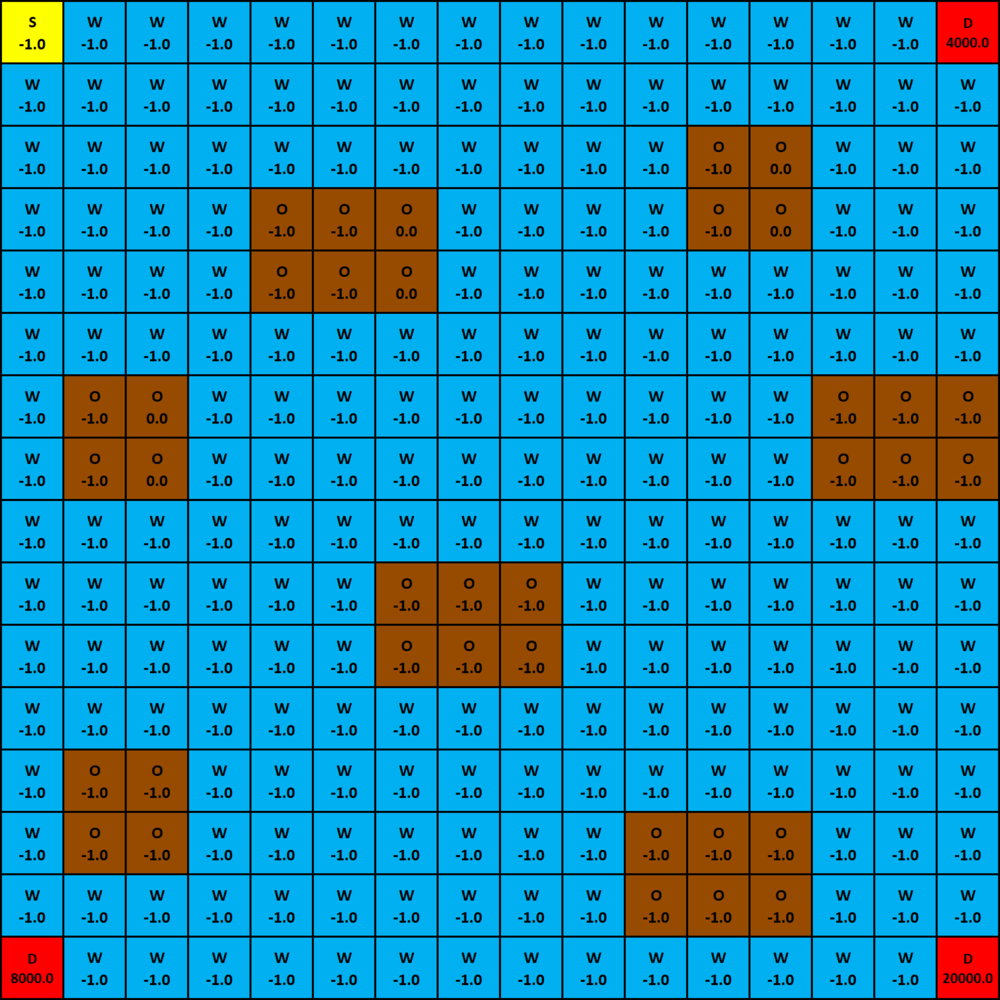

# IERG5350 project implementation

This readme is to provide an overview of whole project. The project is to do route planning in water transport by using reinforement learning algorithms to resolves the rewards maximization problem in water sailing by reaching the destination with the highest priority using the smallest numebr of steps.

## Environment
The environment is a simulation of a cargo ship sailing over the sea. We have implemented two environment:
1. SailingEnv: a decrete environment built on top of frozenlake environment of OpenAI.
2. SailingEnvDQN: our own developed environment which is capable for DQN training

Our environment provides maps in two sizes: 8x8 and 16x16. The 8x8 map serves as the baseline and then we extend the experiment to a 16x16 map measure the scalability of our solutions. Here are the illustrations of our environments:

Figure 1: Training environment with size 8x8
 
 

Figure 2: Training environment with size 16x16
 
 

In the environment, we use the location (current x position, current y position) of the cargo ship over the sea to represent the state. The cargo ship can move **UP**, **DOWN**, **LEFT** and **RIGHT** on the environment. 

There are four types of grids in the map:
1. **S**: the starting point of the cargo ship, with reward -1.0. 
2. **W**: the water (i.e. the sea), with reward -1.0.
3. **O**: the obstacle in the sea, with reward -1.0. Once the cargo ship is move to **O**, that the movement will be terminated.
4. **D**: the destnation of the cargo ship, the rewards of **D** is varies with the diffculties of the cargo ship to reach. There are total $K=3$ destinations in each map.

## Experiment
The train agents using three types of RL algorithms: 
1. Policy Iteration
2. Value Iteration
3. DQN

The experiments of policy iteration and value iteration are conducted in [5350_project_PI.ipynb][1], the experiments of DQN are conducted in [5350_project_DQN.ipynb][2].

## Acknowledgement
Some parts the codes of the RL algorithms are referenced from the assignments of this course.

[1]: 5350_project_PI.ipynb
[2]: 5350_project_DQN.ipynb

